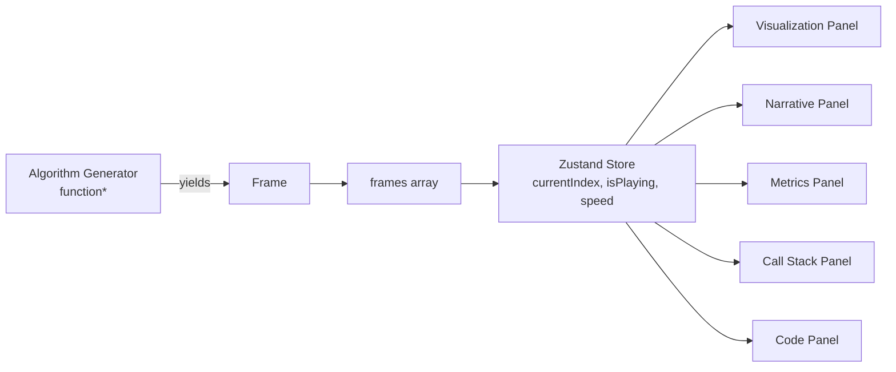

# Lumen

**An interactive laboratory that visualizes not just algorithms, but what the computer is actually doing during execution.**

Most visualizers show you *what* happens. Lumen explains *why* it happens — narrating each decision, tracking the real call stack during recursion, and exposing simulated-but-realistic computer internals (comparisons, memory accesses, complexity) as the algorithm runs.

🔗 **Live demo:** _add your Vercel link here after deploy_

---

## Features

- **6 sorting algorithms** — Bubble, Selection, Insertion, Quick, Merge, Heap Sort
- **Step-by-step narrative** — every comparison and swap is explained in plain language, not just highlighted
- **Real call stack tracking** — recursive algorithms (Quick Sort, Merge Sort, Heap Sort) show actual recursion depth, growing and shrinking as it happens
- **Synced code panel** — pseudocode with the active line highlighted per frame
- **Live metrics** — comparisons, swaps, memory accesses, estimated complexity
- **Sound feedback** — Web Audio API generates a distinct tone per action (compare, swap, call, return)
- **Playback controls** — play/pause/step/speed presets (0.5x–4x)/mute
- **Completion animation** — cascading confirmation effect when a sort finishes
- **Fully responsive** — desktop and mobile layouts

---

## Architecture

The core design decision is the **generator/Frame pattern**: instead of animating an algorithm live, each algorithm runs once and yields a `Frame` — a frozen snapshot of the array, the action taken, the narrative, the call stack, and the metrics at that exact instant. The UI never touches algorithm logic directly; it only reads the current `Frame`.



### Architectural Decisions

- **Generator functions (`function*`) over live mutation.** Each algorithm computes its entire execution once, yielding a `Frame` at every meaningful step. This decouples algorithm logic from rendering entirely — the engine is pure TypeScript with zero React dependencies, and is unit-tested in isolation with Vitest.
- **Frame is the single source of truth for the UI.** Every panel (Visualization, Narrative, Metrics, Call Stack, Code) reads the same `Frame` object. Adding a new algorithm never requires touching the UI layer — only a new generator that produces `Frame`s in the same shape.
- **Zustand over Context/Redux for playback state.** Playback (current frame index, play/pause, speed) is UI-only state, unrelated to algorithm logic. Zustand keeps this in one small store with no boilerplate.
- **Tailwind CSS v4 with CSS-first theming.** Design tokens (colors, fonts) are defined once via `@theme` in `index.css` — no separate JS config file, single source of truth for the design system.
- **CI enforced on every PR.** Lint, unit tests, and a production build all run automatically via GitHub Actions before any code reaches `develop`.

---

## Tech Stack

| Layer | Choice |
|---|---|
| Build tool | Vite 8 |
| Framework | React 19 + TypeScript |
| Styling | Tailwind CSS v4 |
| State management | Zustand |
| Animation | Framer Motion |
| Testing | Vitest |
| CI/CD | GitHub Actions |

---

## Getting Started

### Prerequisites

- Node.js 22+
- npm

### Installation

```bash
git clone https://github.com/Rxmainless/Lumen-Algorithm-Lab.git
cd Lumen-Algorithm-Lab
npm install
```

### Development

```bash
npm run dev
```

Opens at `http://localhost:5173`.

### Running tests

```bash
npx vitest run
```

### Production build

```bash
npm run build
```

---

## Project Structure